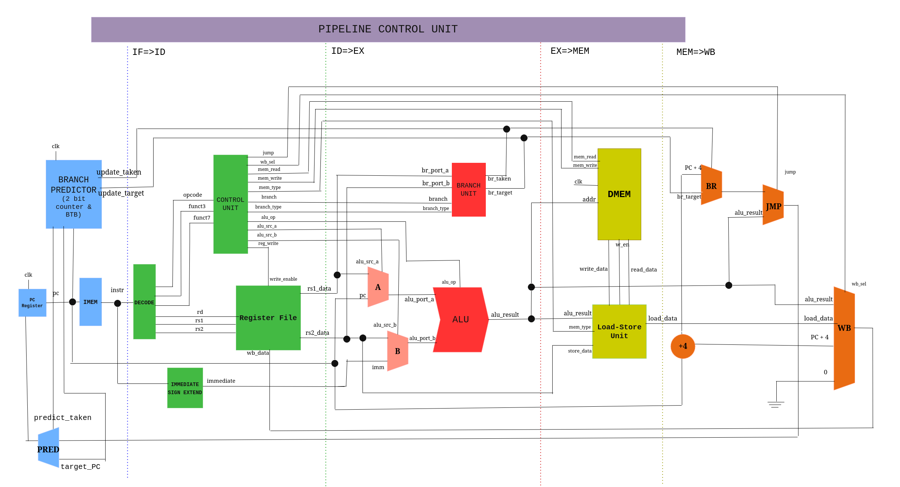

# RV32I RISC-V CPU

A fully pipelined 32-bit RISC-V (RV32I) processor core featuring branch prediction, forwarding/hazard detection logic, and verification.

## Architecture

The core follows a balanced 5-stage execution model. Data forwarding paths allow instructions to consume results before they are officially written back to the register file, drastically improving IPC.




## Specification

* **ISA Compliance**: Full support for the RISC-V `RV32I` base integer instruction set. 
All of RISC-V Official RV32I Compliance tests pass successfully.
* **5-Stage Pipeline**: Classic RISC pipeline architecture divided into:
    1.  **IF** (Instruction Fetch)
    2.  **ID** (Instruction Decode / Register Read)
    3.  **EX** (Execute / ALU / Address Generation)
    4.  **MEM** (Memory Access)
    5.  **WB** (Write Back)
* **Hazard Management**: 
    * Pipeline control unit to eliminate data stalls where possible.
    * Automatic pipeline interlocking/stalling for unavoidable hazards.
* **Branch Prediction**: Integrated branch prediction unit to minimize control hazard penalties and optimize CPI.
* **Verification**: Testbenches and simulation setups verifying edge cases, instruction coverage, and pipeline testing.

---


## Branch Prediction 

The processor core implements a **2-Bit Global Branch Predictor** coupled with a **Branch Target Buffer (BTB)** in the Fetch (IF) stage.

### Architecture Overview
* **Global History Register (GHR)**: A single, global 2-bit saturating up-down counter that tracks the outcome of branches across the execution of a program.
* **Branch Target Buffer (BTB)**: A table that stores the target addresses of previously executed branches.


--- 

## Supported Instruction Set

This processor implements the standard **RV32I** Base Integer Instruction Set:

* **R-Type**: `add`, `sub`, `sll`, `slt`, `sltu`, `xor`, `srl`, `sra`, `or`, `and`
* **I-Type**: `addi`, `slti`, `sltiu`, `xori`, `ori`, `andi`, `slli`, `srli`, `srai`, `lb`, `lh`, `lw`, `lbu`, `lhu`, `jalr`
* **S-Type**: `sb`, `sh`, `sw`
* **B-Type**: `beq`, `bne`, `blt`, `bge`, `bltu`, `bgeu`
* **U-Type**: `lui`, `auipc`
* **J-Type**: `jal`

> Excluding System instructions: `ecall` and `ebreak`.

---

## Tools

* **Language**: [SystemVerilog]
* **Simulation**: [Icarus Verilog and Synopsys VCS]
* **Waveform Viewer**: [GTKWave]
* **Synthesis**: [Synopsys Design Compiler]

### Synthesis 

The design was synthesized using Synopsys Design Compiler. The timing results below demonstrate the maximum operating frequency achieved by the 5-stage pipelined architecture:

| Metric | Value | Notes |
| :--- | :--- | :--- |
| **Target Clock Period** | 5.5 ns | Critical path constrained during synthesis |
| **Max Frequency** | 182 MHz | Achieved after pipeline stage balancing |

---

## Installation & Usage

### Prerequisites
* iverilog
* GTKWave
* RISC-V GNU Toolchain (Optional, for compiling your own assembly tests)

OR 

* Synopsys

### Usage
1. Clone the repository:
```bash
   git clone [https://github.com/tasath26/RV32I-CPU.git](https://github.com/tasath26/RV32I-CPU.git)
   cd RV32I-CPU
```
    
2. Choose Platform 
```bash
    chmod +x platform.sh
    ./platform.sh <icarus OR synopsys>
```

3. Make and run Tests 
```bash
    make tests 
    make run TEST=<testname without the .hex suffix> TEST_DIR=<directory containing tests>
```
